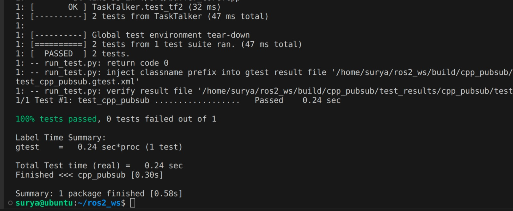
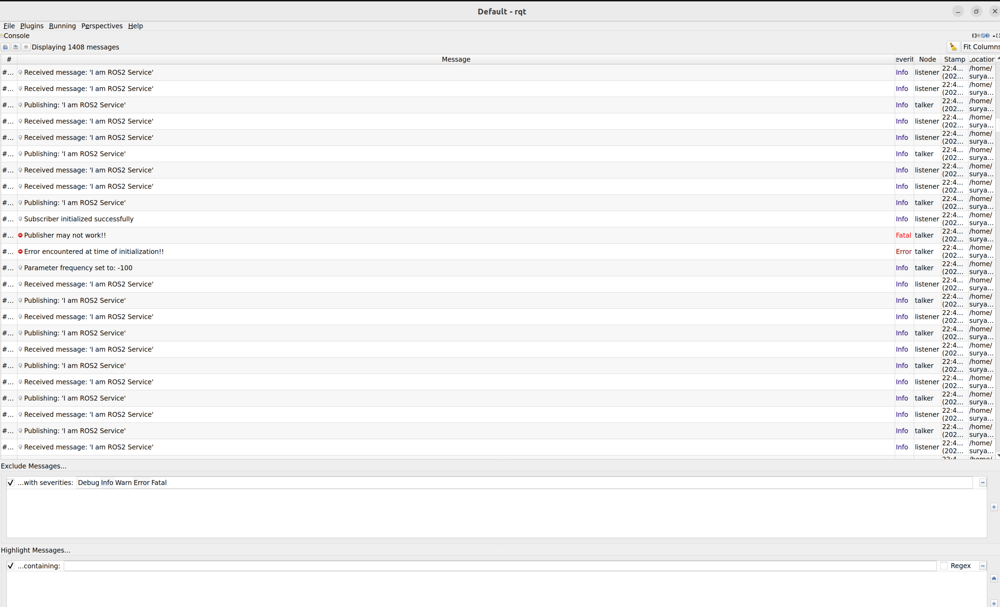
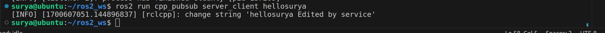

[](https://opensource.org/licenses/Apache-2.0)

# ROS2 Publisher/Subscriber

Author: Surya Chappidi <br>
UID: 119398166

## Overview
This repository provides a simple ROS2 Publisher/Subscriber example.

## Assumptions
Before you proceed with building and running this project, please ensure the following:

- ROS2 is already set up locally on your system.
- You have a ROS2 workspace named `ros2_ws` in your home directory.

## Build
### First-Time Build

```bash
cd ~/ros2_ws/src
git clone https://github.com/SuryaVC/beginner_tutorials
cd ..
colcon build --packages-select cpp_pubsub
. install/setup.bash
```
## Run

```bash
ros2 run cpp_pubsub talker
```
Then, open a new terminal and run the subscriber:
```bash
. install/setup.bash
ros2 run cpp_pubsub listener
```

To quit the talker and listener, press `Ctrl+C` in their respective terminals.

Using launch file to run both talker and listener together with custom frequency
```bash
ros2 launch cpp_pubsub service_launch.yaml frequency:=1
```
Open new terminal to call the service to modify message
```bash
ros2 run cpp_pubsub server_client surya
```
## Working with Ros bag and tf2
```bash
cd ~/ros2_ws/src/beginner_tutorials/cpp_pubsub
```
To launch with recording or not use the bool argument.
```bash
ros2 launch launch/custom_launch.py  enable_recording:=True frequency:=1
```
replay the recorded data from ros2 bag recording:
```bash
ros2 bag play results/bag_output
```
in new terminal run the below command
```bash
ros2 run cpp_pubsub listener
```
bag info
```bash
ros2 bag info results/bag_output
```
run the talker with the tf2
```bash
ros2 run cpp_pubsub talker talk 0 0 1 0 0 0
```
In another terminal run
```bash
ros2 run tf2_ros tf2_echo world talk
```
output:
```
At time 0.0
- Translation: [0.000, 0.000, 1.000]
- Rotation: in Quaternion [0.000, 0.000, 0.000, 1.000]
- Rotation: in RPY (radian) [0.000, -0.000, 0.000]
- Rotation: in RPY (degree) [0.000, -0.000, 0.000]
- Matrix:
  1.000  0.000  0.000  0.000
  0.000  1.000  0.000  0.000
  0.000  0.000  1.000  1.000
  0.000  0.000  0.000  1.000
```

## Tests
```bash
colcon test --event-handlers console_direct+ --packages-select cpp_pubsub
```
<p align="center">

</p>

## Checks
### cpplint:

```bash
cpplint --filter=-build/c++11,+build/c++17,-build/namespaces,-build/include_order $( find . -name *.cpp | grep -vE -e "^./build/" -e "^./vendor/" )
```

### cppcheck:
```bash
cppcheck --enable=all --std=c++11 --check-config --suppress=missingIncludeSystem $( find . -name *.cpp | grep -vE -e "^./build/" -e "^./vendor/" )
```

## Results:
Frames PDF, Cpplint and Cppcheck output are in results directory.

### Logging screenshot
<p align="center">

</p>
All logs were not been able to show in the screenshot. All 5 logging levels were used in the publisher file for your reference.

### Screenshot of modifying message using service
<p align="center">

</p>


## Dependencies:
rclcpp <br>
std_msgs
